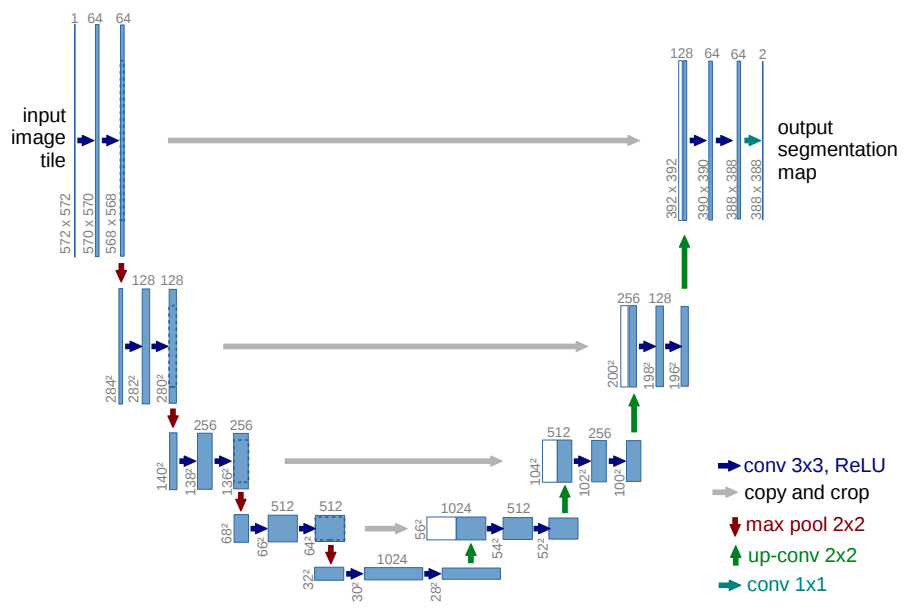

# U-Net
This is an implementation of the convoluation neural network [U-Net](https://lmb.informatik.uni-freiburg.de/people/ronneber/u-net/) in [tensorflow 2](https://www.tensorflow.org/), with tensorflow.keras.

The JupyterLab notebook covers the entire workflow, including
* model creation
* model training
* prediction

The goal is to demonstrate how each step works, so I made the code as plain as possible (with least refactoring), so that they are most easy to pick up and understand.

## Dataset 
The dataset was obtained from the [Carvana Kaggle competition](https://www.kaggle.com/c/carvana-image-masking-challenge). If one wants to run the notebook, download the images to a local folder, and change the paths in the notebook accordingly. I highly recommend storing the images on Google Drive, and then mount Google Drive in the notebook.
